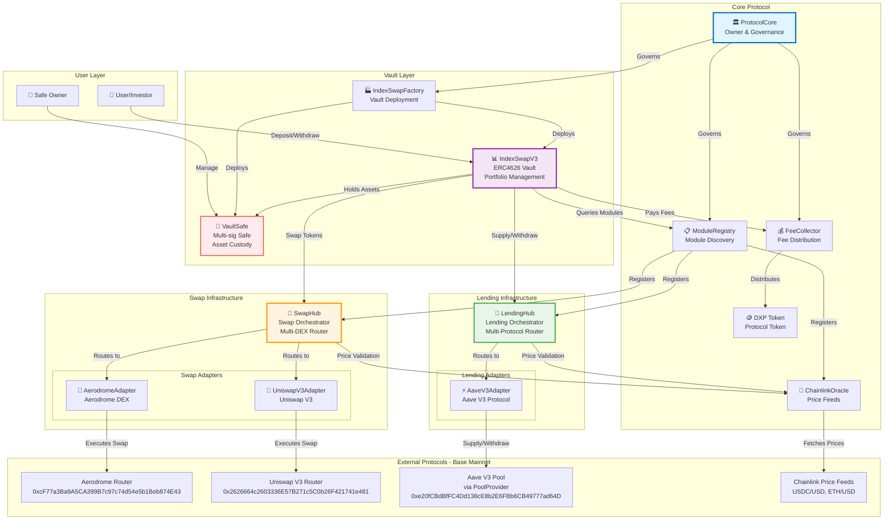
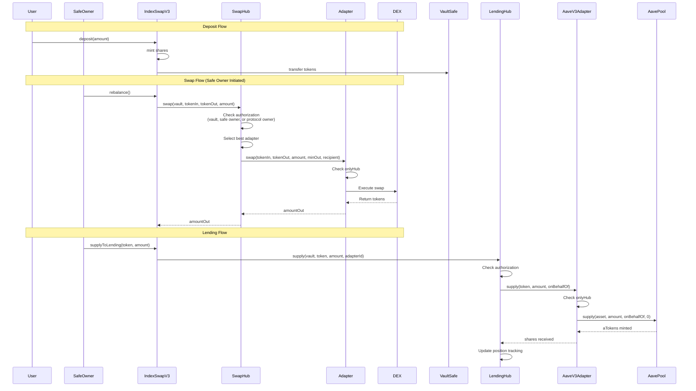
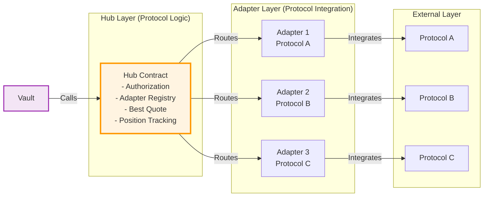
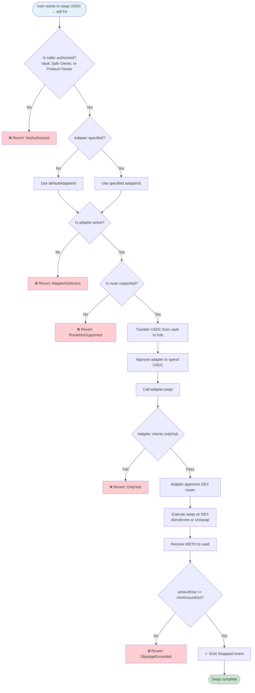

# V3 Protocol Architecture - Base Mainnet

## System Overview

## Authorization Flow

## Hub-Adapter Pattern

## Data Flow - Swap Example

## Contract Addresses (Base Mainnet)

### Core Contracts
- **ProtocolCore**: Deployed via deploy-protocol.ts
- **DXP Token**: Deployed via deploy-protocol.ts
- **FeeCollector**: Deployed via deploy-protocol.ts
- **ModuleRegistry**: Deployed via deploy-protocol.ts
- **ChainlinkOracle**: Deployed via deploy-protocol.ts

### Swap Infrastructure
- **SwapHub**: Deployed via deploy-protocol.ts
- **AerodromeAdapter**: Deployed via deploy-protocol.ts
  - Adapter ID: `keccak256("AERODROME")`
- **UniswapV3Adapter**: Deployed via deploy-protocol.ts
  - Adapter ID: `keccak256("UNISWAP_V3")`

### Lending Infrastructure
- **LendingHub**: Deployed via deploy-protocol.ts
- **AaveV3Adapter**: Deployed via deploy-protocol.ts
  - Adapter ID: `keccak256("AAVE_V3")`

### Factory & Vault
- **IndexSwapFactory**: Deployed via deploy-protocol.ts
- **VaultSafe** (Test): Deployed via deploy-protocol.ts
- **IndexSwapV3** (Test): Deployed via deploy-protocol.ts

### External Protocol Addresses (Base Mainnet)
- **USDC**: `0x833589fCD6eDb6E08f4c7C32D4f71b54bdA02913`
- **WETH**: `0x4200000000000000000000000000000000000006`
- **Aave Pool Provider**: `0xe20fCBdBfFC4Dd138cE8b2E6FBb6CB49777ad64D`
- **Aerodrome Router**: `0xcF77a3Ba9A5CA399B7c97c74d54e5b1Beb874E43`
- **Aerodrome Factory**: `0x420DD381b31aEf6683db6B902084cB0FFECe40Da`
- **Uniswap V3 Router**: `0x2626664c2603336E57B271c5C0b26F421741e481`
- **Uniswap V3 Quoter**: `0x3d4e44Eb1374240CE5F1B871ab261CD16335B76a`
- **Chainlink USDC/USD**: `0x7e860098F58bBFC8648a4311b374B1D669a2bc6B`
- **Chainlink ETH/USD**: `0x71041dddad3595F9CEd3DcCFBe3D1F4b0a16Bb70`

## Key Features

### Hub-Adapter Architecture
- **Modularity**: Add/remove DEXes and lending protocols without redeploying hubs
- **Best Execution**: `getBestQuote()` compares all active adapters
- **Fallback**: Route to alternative protocols if one fails
- **Upgradability**: Update adapter implementations independently

### Authorization Model
- **Three-tier access**: Vault itself, Safe owners, Protocol owner
- **Hub-only adapters**: Adapters can only be called by their respective hubs
- **Reentrancy protection**: All hubs use `nonReentrant` modifier

### Position Tracking
- **LendingHub**: Tracks shares, supplied amounts, and adapter IDs per vault per token
- **Interest accrual**: Calculates current value vs supplied principal
- **Multi-adapter support**: Each vault can use different adapters per token

### Fee Management
- **Performance fees**: Charged on profits above high water mark
- **Protocol cut**: FeeCollector distributes fees between vault owner and protocol
- **Authorized vaults**: Only whitelisted vaults can use FeeCollector
